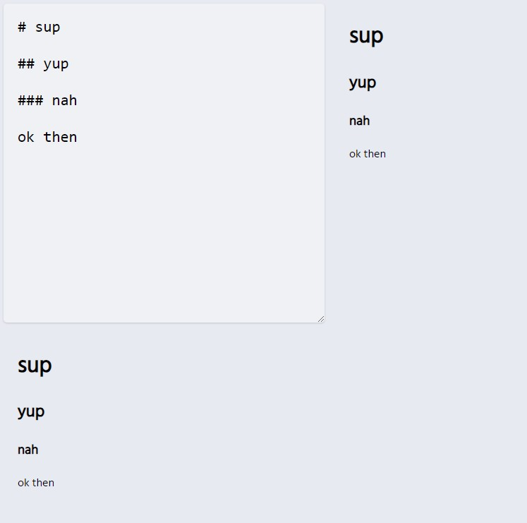

# Markdown Editor

## Table of contents

- [Overview](#overview)
  - [The challenge](#the-challenge)
  - [Screenshot](#screenshot)
  - [Links](#links)
- [My process](#my-process)
  - [Built with](#built-with)
  - [What I learned](#what-i-learned)
  - [Continued development](#continued-development)
- [Author](#author)

## Overview

### The challenge

Users should be able to:

- View the optimal layout for the app depending on their device's screen size
- Use an actual markdown editor

### Screenshot

### Links

- Live Site URL: [View](https://travellist3.netlify.app/)

## My process

- The `App` component renders a textarea and a preview area side by side.
- The `markdown` state variable holds the markdown content initially set to "# sup".
- When the user types in the textarea, the `handleChange` function updates the `markdown` state with the new content.
- The ReactMarkdown component takes the `markdown` state as its children prop and renders it as parsed Markdown in the preview area.
- This allows users to see a live preview of how their markdown content will be rendered as HTML.

### Built with

- Semantic HTML5 markup
- CSS custom properties
- Mobile-Responsive Design
- JavaScript - Scripting language
- [React](https://reactjs.org/) - JS library

### What I learned

Used npm install marked
Used npm install react-markdown

### Continued development

Maybe used for reference.

## Author

- Website - [Cameron Howze](https://camkol.github.io/)
- Frontend Mentor - [@camkol](https://www.frontendmentor.io/profile/camkol)
- GitHub- [@camkol](https://github.com/camkol)
- LinkedIn - [@cameron-howze](https://www.linkedin.com/in/cameron-howze-28a646109/)
- E-Mail - [cameronhowze4@outlook.com](mailto:cameronhowze4@outlook.com)
